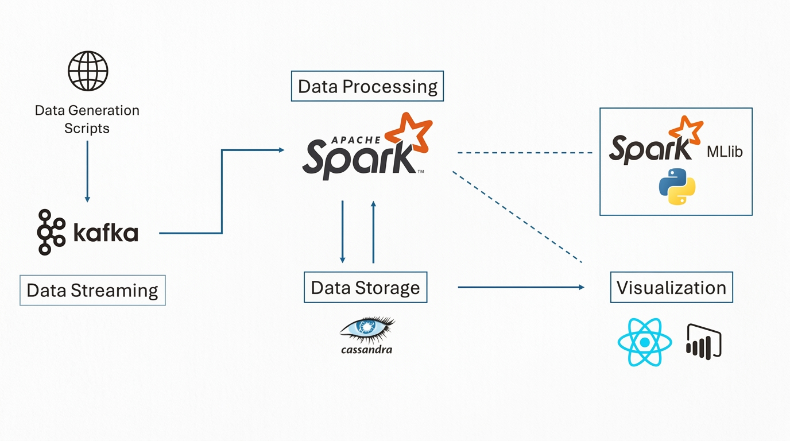

# CardShield: Real-Time Credit Card Fraud Detection

CardShield is a graduate project that demonstrates an end-to-end fraud detection pipeline for streaming credit card transactions. The system combines data preprocessing, model training, event streaming, real-time scoring, Cassandra persistence, and a lightweight dashboard for monitoring results.

## Project Highlights
- Built an end-to-end fraud detection workflow using **PySpark, Kafka, Cassandra, and Python**.
- Trained a fraud classification model on large-scale transaction data and prepared encoded artifacts for downstream scoring.
- Simulated transaction streaming with a Python producer and processed predictions in near real time.
- Added a dashboard layer to visualize transaction activity and fraud metrics.
- Documented setup steps, system architecture, and project presentation assets in one place.

## Repository Structure
```
CardShield/
├── assets/
│   ├── architecture.png
│   └── tech_stack.png
├── docs/
│   ├── commands.txt
│   ├── project_presentation.pptx
│   └── SETUP.md
├── models/
│   └── encoders/
│       └── LE_model_v1.pkl
├── notebooks/
│   ├── cassandra_setup.ipynb
│   ├── data_cleaning.ipynb
│   ├── fraud_detection.ipynb
│   ├── kafka_script.ipynb
│   └── model_training.ipynb
├── scripts/
│   ├── dashboard_demo.py
│   └── producer.py
├── .gitignore
├── LICENSE
└── README.md
```

## Tech Stack


### Core Components
- **Data generation / ingestion:** Python scripts and notebook-driven preparation
- **Streaming:** Apache Kafka + Zookeeper
- **Modeling:** PySpark / Spark ML
- **Storage:** Apache Cassandra
- **Visualization:** Streamlit-style Python dashboard workflow

## Dataset
This project uses the public fraud detection dataset from Kaggle and draws inspiration from the Sparkov synthetic data generation workflow. The full dataset is large and is not included in this repository.

## Workflow
1. Clean and prepare raw transaction data.
2. Train and evaluate the fraud detection model.
3. Serialize encoders / artifacts needed during inference.
4. Start Kafka, Zookeeper, and Cassandra services.
5. Produce transaction events to Kafka.
6. Consume and score transactions.
7. Store outputs in Cassandra.
8. Display transaction and fraud insights on the dashboard.

## Key Files
- `notebooks/data_cleaning.ipynb` — preprocessing and feature preparation
- `notebooks/model_training.ipynb` — training workflow and model experimentation
- `notebooks/fraud_detection.ipynb` — fraud scoring logic and pipeline exploration
- `notebooks/kafka_script.ipynb` — Kafka integration work
- `notebooks/cassandra_setup.ipynb` — Cassandra setup / data flow support
- `scripts/producer.py` — transaction producer for Kafka topic streaming
- `scripts/dashboard_demo.py` — dashboard / reporting logic

## Environment Notes
Recommended baseline environment:
- Python 3.11
- Java 8+
- Apache Spark
- Apache Kafka
- Apache Cassandra

Project-specific startup commands are included in `docs/commands.txt`.

## System Architecture


## Challenges Encountered
- Environment compatibility across Spark, Kafka, Cassandra, and Python
- High-volume synthetic data generation and handling
- Cassandra setup and memory allocation tuning
- Connecting batch model artifacts to streaming inference cleanly

## Academic Context
This repository reflects a master's first-semester project focused on building a practical big-data fraud detection pipeline instead of a minimal toy notebook.

<!-- documented data preparation stage -->

<!-- expanded training workflow details -->
