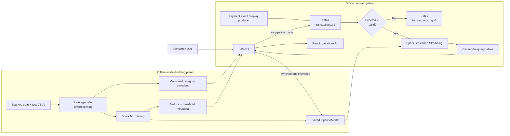

<div align="center">
  

  <h1>CardShield</h1>

  <h3>Real Time Payment Fraud Intelligence</h3>

  <p>
    
    
    
    
  </p>

  <p>
    
    
    
  </p>

  <p>
    <a href="https://cardshield-bwq.pages.dev/"><strong>View Live Project ↗</strong></a>
    &nbsp;·&nbsp;
    <a href="#the-project-story"><strong>Project Story</strong></a>
    &nbsp;&middot;&nbsp;
    <a href="#architecture"><strong>Architecture</strong></a>
    &nbsp;&middot;&nbsp;
    <a href="#how-a-transaction-moves-through-the-system"><strong>Decision Pipeline</strong></a>
    &nbsp;&middot;&nbsp;
    <a href="#model-results"><strong>Model Results</strong></a>
    &nbsp;&middot;&nbsp;
    <a href="#run-cardshield"><strong>Quick Start</strong></a>
  </p>
</div>

---

**CardShield turns a payment event into a scored, persisted, and inspectable fraud
decision.** Kafka decouples ingestion, Spark Structured Streaming applies the
saved model, Cassandra stores query-ready operational views, FastAPI exposes the
system, and React makes the complete decision path visible.

The project began as an academic fraud classifier and grew into an end-to-end
reference system. Its central question is:

> What has to exist around a fraud model before its prediction becomes useful,
> traceable, and operable?

The answer is more than inference. CardShield combines leakage-aware model
training, versioned event contracts, replayable Kafka messages, independent stream
checkpoints, dead-letter handling, model metadata, query-oriented storage, health
reporting, and a transaction trace that connects submission to the operator view.

> [!IMPORTANT]
> CardShield is a production-oriented reference implementation and portfolio
> project, not a certified payment-processing system. The included Docker Compose
> environment is designed for development and demonstration. See
> [Production boundary](#production-boundary) before treating it as a deployment
> blueprint.

## Table of contents

- [The problem](#the-problem)
- [The project story](#the-project-story)
- [What CardShield does](#what-cardshield-does)
- [Architecture](#architecture)
- [How a transaction moves through the system](#how-a-transaction-moves-through-the-system)
- [Machine-learning pipeline](#machine-learning-pipeline)
- [Important engineering decisions](#important-engineering-decisions)
- [Technology choices](#technology-choices)
- [Data contracts and storage model](#data-contracts-and-storage-model)
- [Model results](#model-results)
- [Run CardShield](#run-cardshield)
- [Using the application](#using-the-application)
- [API reference](#api-reference)
- [Configuration](#configuration)
- [Testing and quality checks](#testing-and-quality-checks)
- [Repository guide](#repository-guide)
- [Failure behavior and recovery](#failure-behavior-and-recovery)
- [Production boundary](#production-boundary)
- [Future work](#future-work)
- [License](#license)

## The problem

Fraud detection is an imbalanced, cost-sensitive, time-sensitive problem.
Fraudulent transactions are rare, so a model can report excellent accuracy while
missing the events that matter. At the same time, an aggressive detector can
decline too many legitimate purchases and create a different kind of loss.

A useful fraud platform therefore needs to do more than return `0` or `1`:

- score transactions soon enough to support an operational decision;
- preserve the probability and model version behind that decision;
- tolerate malformed events without stopping the stream;
- recover from restarts without silently skipping or duplicating results;
- expose recent decisions in the access patterns operators actually use;
- evaluate fraud recall and false-positive behavior, not just accuracy;
- keep training-time and serving-time feature logic consistent;
- make the boundary between a working prototype and a payment-grade system clear.

CardShield models that larger system. It treats the ML model as one component in a
decision pipeline rather than as the entire product.

## The project story

CardShield began as a big-data fraud-detection project built around the
[Sparkov credit-card transaction dataset](https://www.kaggle.com/datasets/kartik2112/fraud-detection/data).
The notebooks in [`notebooks/`](notebooks/) preserve that exploratory stage:
cleaning data, training candidate models, experimenting with Kafka, and setting up
Cassandra.

The repository then evolved from an analysis into an application:

1. Notebook logic was extracted into reproducible Python entry points.
2. Categorical encoders were made deterministic and fitted only on training data.
3. A time-aware calibration/evaluation split and class weighting were added.
4. A versioned Kafka contract and dead-letter path were introduced.
5. Spark Structured Streaming became the asynchronous scoring engine.
6. Cassandra tables were designed around dashboard and alert queries.
7. FastAPI connected inference, health, model metadata, and pipeline traces.
8. A React interface made the system observable from transaction to decision.
9. Docker Compose, migrations, tests, logging, and readiness checks turned the
   pieces into one repeatable local environment.

That evolution is the point of the project: moving from “a model works” to “a
model participates in a system.”

## What CardShield does

### Data and model lifecycle

- Reads the Sparkov training and held-out CSV files.
- Fits stable categorical mappings on the training set only.
- Preserves unseen categories with an explicit `-1` value.
- Builds separate training, validation, and transaction-replay artifacts.
- Engineers time-of-day, day-of-week, and customer-to-merchant distance features.
- Compensates for class imbalance with fraud-class weighting.
- Selects a decision threshold on calibration data.
- Evaluates the selected model on a later held-out slice.
- Saves a versioned Spark pipeline and JSON evaluation metadata.

### Live decision lifecycle

- Validates a schema-versioned transaction event.
- Publishes events to a partitioned Kafka topic using the transaction ID as key.
- Routes malformed or unsupported events to a dead-letter topic.
- Scores valid events in Spark Structured Streaming micro-batches.
- Checkpoints stream progress for restart recovery.
- Stores the decision, fraud probability, and model version in Cassandra.
- Maintains a separate fraud-alert view for positive decisions.
- Exposes health, recent decisions, model metrics, and pipeline traces over HTTP.
- Presents live operations, synchronous simulation, and end-to-end streaming
  simulation in a React website.

## Architecture

CardShield has an offline model-building plane and an online decision plane. The
same saved Spark `PipelineModel` is loaded by both online scoring paths.



### Component responsibilities

| Component | Responsibility |
|---|---|
| Preprocessor | Validate raw columns, fit training-only encoders, and create model/replay datasets |
| Spark trainer | Engineer features, weight classes, train the Random Forest, select a threshold, and record metrics |
| Producer | Validate replay rows and publish acknowledged, idempotent Kafka messages |
| Kafka | Decouple transaction ingestion from scoring and retain ordered, replayable events |
| Streaming scorer | Parse and validate events, route bad data, run the saved model, and checkpoint progress |
| Cassandra | Store denormalized recent-transaction, fraud-alert, and pipeline-trace views |
| FastAPI | Serve synchronous inference, submit live events, aggregate dashboard data, and report health/model metadata |
| React | Provide the landing page, operations dashboard, simulator, system view, and transaction audit drawer |

## How a transaction moves through the system

CardShield intentionally exposes two inference paths because they serve different
purposes.

### 1. Production-like asynchronous path

This is the path used by replayed transactions and the simulator's **Live
pipeline** mode:

```text
API or replay CSV
  -> TransactionEvent validation
  -> Kafka transactions.v1
  -> Spark JSON parsing and contract checks
  -> saved Spark ML pipeline
  -> Cassandra transactions_by_day
  -> Cassandra fraud_alerts_by_day when flagged
  -> FastAPI dashboard query
  -> React dashboard
```

For an interactive transaction, CardShield also records this short-lived trace:

```text
API_ACCEPTED
  -> KAFKA_PUBLISHED
  -> MODEL_SCORED
  -> CASSANDRA_PERSISTED
```

The UI polls that trace and reports measured end-to-end latency. Trace rows expire
after 24 hours; they are demo observability, not a permanent compliance ledger.

### 2. Synchronous path

The simulator's **Direct model** mode calls `POST /api/predict`. FastAPI validates
and encodes the request, scores a one-row Spark DataFrame with the same saved
pipeline, and attempts to persist the result directly to Cassandra.

This path is useful for model exploration and API demonstrations. It deliberately
bypasses Kafka and the streaming scorer, so it should not be mistaken for proof
that the asynchronous pipeline is healthy.

## Machine-learning pipeline

### Dataset strategy

The raw Sparkov files have distinct roles:

- `fraudTrain.csv` is the only source used to fit categorical mappings and the
  model.
- `fraudTest.csv` remains held out from fitting. Preprocessing writes it both as
  the validation dataset and as a richer replay dataset.
- During training, the held-out set is ordered by `unix_time` and divided at its
  approximate median. The earlier half calibrates the threshold; the later half
  provides final evaluation.

This prevents the most obvious form of preprocessing leakage and avoids selecting
and reporting a threshold on the same rows.

### Input features

The event contract carries eleven raw model features:

| Type | Features |
|---|---|
| Transaction | `amt`, `unix_time` |
| Customer geography | `lat`, `long`, `city_pop` |
| Merchant geography | `merch_lat`, `merch_long` |
| Encoded categories | `merchant_label`, `category_label`, `gender_label`, `job_label` |

The Spark pipeline derives:

- `transaction_hour` from Unix time;
- `transaction_day_of_week` from Unix time;
- `distance_km`, an approximate customer-to-merchant geographic distance.

Categorical labels then pass through Spark `StringIndexer` and one-hot encoding.
The final feature vector is consumed by a weighted
`RandomForestClassifier`.

### Class imbalance

The current training artifact contains roughly 172 legitimate rows for every
fraud row. CardShield assigns fraud rows a proportional class weight instead of
allowing the majority class to dominate the objective.

This does not solve the business-cost problem by itself. It makes minority-class
errors matter during fitting; the operating threshold still needs to reflect the
real cost of missed fraud and false declines.

### Threshold selection

CardShield evaluates a fixed set of probability thresholds on the calibration
slice. It selects the candidate with the highest fraud F1 among candidates that
reach at least 60% fraud recall, then applies that threshold to the final
evaluation slice.

This policy is explicit and reproducible, but it is a project policy—not a
universal fraud policy. A real deployment should select the threshold from
fraud-loss, review-capacity, customer-friction, and fairness constraints.

### Saved artifacts

Running preprocessing and training creates:

```text
data/clean_train.csv
data/clean_validation.csv
data/clean_test.csv
models/encoders/categories-v1.json
models/fraud_pipeline/
models/fraud_pipeline-metadata.json
```

The metadata records the algorithm, feature lists, seed, class weight, row
counts, chosen threshold, confusion matrix, precision, recall, F1, PR-AUC, and
ROC-AUC. This keeps a model decision tied to evidence rather than only to a
serialized model directory.

## Important engineering decisions

| Decision | Why it was made | Tradeoff |
|---|---|---|
| Fit encoders on training data only | Prevent validation information from influencing feature preparation | Unseen production values map to `-1` and need drift monitoring |
| Keep one saved Spark pipeline for batch and online scoring | Reduces training/serving feature skew | A local Spark session is heavy for single-request HTTP inference |
| Use a Random Forest | Handles nonlinear interactions, mixed features, and class weights while remaining straightforward to operate in Spark | Larger artifacts and less transparent decisions than a linear model |
| Weight the fraud class | Accuracy is otherwise dominated by legitimate transactions | Weighting and thresholding must still be tuned to business costs |
| Calibrate on an earlier held-out slice and evaluate on a later slice | Produces a more honest time-aware estimate | A single historical split cannot represent all future drift |
| Version the event envelope | Allows consumers to reject incompatible payloads deliberately | Schema evolution needs an explicit compatibility process |
| Send invalid events to a DLQ | One malformed event should not stop the scoring stream | The current DLQ preserves the original payload but does not attach a structured error reason |
| Key Kafka events by transaction ID | Gives stable partitioning and preserves per-key ordering | Ordering is not global across all transactions |
| Use Kafka producer idempotence and acknowledged writes | Reduces duplicates caused by producer retries | End-to-end exactly-once behavior still depends on downstream design |
| Checkpoint both scoring and DLQ streams | Lets Spark restore processed offsets after restart | Local checkpoints are not durable enough for a multi-host deployment |
| Derive persistence time from the Kafka timestamp | A retried micro-batch produces the same Cassandra primary key | Re-publishing the same transaction as a new Kafka record is a new event |
| Model Cassandra tables from queries | Recent decisions and alerts can be read without scans or `ALLOW FILTERING` | Data is duplicated and every new access pattern may require another table |
| Partition Cassandra by day and one of 16 stable shards | Bounds partition growth and distributes a busy day | Reading a time window requires fan-out across day/shard partitions |
| Store model version and probability with every result | Supports auditability, comparison, and model rollbacks | Correct governance still requires a real model registry |
| Degrade the API when Kafka or Cassandra is unavailable | Direct inference can remain useful while optional components fail | Dashboard and live-pipeline features correctly return unavailable errors |
| Keep notebooks beside production modules | Preserves the project's learning history | Notebooks are reference material, not the deployment source of truth |

## Technology choices

| Technology | Role | Why it fits this project |
|---|---|---|
| Python 3.11 | Data, services, and orchestration | Shared language across preprocessing, Spark, Kafka, Cassandra, and API code |
| pandas | CSV preparation and replay reading | Practical for the source dataset and chunked local replay |
| Apache Spark 3.5 / MLlib | Feature pipeline, model training, and stream scoring | Demonstrates one distributed processing model across offline and online work |
| Apache Kafka | Event transport | Decouples ingestion and scoring while supporting replay and partitioned scale |
| Apache Cassandra | Operational persistence | Encourages explicit, high-write-throughput, query-first data modeling |
| FastAPI | HTTP and dashboard aggregation layer | Typed validation, lightweight endpoints, and automatic OpenAPI documentation |
| React 19 + TypeScript + Vite | User interface | Fast development with typed API models and component-based operational views |
| Docker Compose | Local environment | Makes Kafka, Cassandra, API, scorer, producer, and web services reproducible |
| Pytest, Ruff, MyPy, Vitest, ESLint | Quality controls | Cover behavior, formatting, type safety, and frontend logic |

## Data contracts and storage model

### Kafka topics

| Topic | Partitions | Purpose |
|---|---:|---|
| `transactions.v1` | 3 | Validated transaction input |
| `transactions.dlq.v1` | 1 | Original key/value for events rejected by the stream contract |

Kafka topic creation is explicit; broker auto-creation is disabled in Compose.

### Transaction event

Events use `schema_version: 1`. Required values are validated for presence,
numeric type, finite amounts, nonnegative amount, and valid coordinate ranges.
Optional descriptive fields make dashboard records understandable without
becoming model inputs.

```json
{
  "schema_version": 1,
  "trans_num": "6de094e9129f4d9e",
  "amt": 149.95,
  "lat": 41.8781,
  "long": -87.6298,
  "city_pop": 2746388,
  "unix_time": 1782752400,
  "merch_lat": 40.7128,
  "merch_long": -74.006,
  "merchant_label": 42,
  "category_label": 11,
  "gender_label": 0,
  "job_label": 173,
  "merchant": "example_merchant",
  "category": "shopping_net",
  "gender": "F",
  "job": "Engineer"
}
```

Do not interpret the sample values as a real fraud signature. The model evaluates
the complete learned feature pattern.

### Cassandra tables

| Table | Partition key | Purpose |
|---|---|---|
| `transactions_by_day` | `(transaction_day, shard)` | Recent scored transactions ordered newest first |
| `fraud_alerts_by_day` | `(alert_day, shard)` | Positive model decisions without filtering the full transaction view |
| `pipeline_trace_by_transaction` | `trans_num` | Ordered, 24-hour interactive trace for one transaction |

`transactions_by_day` and `fraud_alerts_by_day` use the Kafka record timestamp,
transaction ID, and time bucket in their primary keys. A retried Spark
micro-batch therefore overwrites the same operational result instead of creating
a second result row.

The dashboard queries up to seven days across 16 shards, merges the rows in the
API, sorts by timestamp, and returns the requested recent window. That is
appropriate for this local application; a larger deployment would consider
pre-aggregated metrics and asynchronous shard reads.

## Model results

The checked-in `models/fraud_pipeline-metadata.json` reports the following result
for model `local-v1`. These numbers are generated artifacts, not hard-coded
claims; retraining can change them.

| Metric | Value |
|---|---:|
| Evaluation rows | 278,217 |
| Fraud recall | 66.52% |
| Fraud precision | 25.56% |
| Fraud F1 | 36.93% |
| PR-AUC | 45.24% |
| ROC-AUC | 93.23% |
| Accuracy | 99.24% |
| Selected threshold | 0.625 |

Confusion matrix:

| | Predicted legitimate | Predicted fraud |
|---|---:|---:|
| Actual legitimate | 275,488 | 1,800 |
| Actual fraud | 311 | 618 |

Accuracy is included for completeness, but it is not the release metric. With
fraud representing a small fraction of rows, a model can be highly accurate while
providing poor fraud coverage. Fraud recall, precision, PR-AUC, review volume,
false-decline cost, and expected fraud loss are the more relevant discussion.

## Run CardShield

### Requirements

- Python 3.11
- Java 17
- Node.js 20 or newer
- Docker Desktop with Docker Compose
- Approximately 3 GB of free disk space for data, model artifacts, and containers

On macOS:

```bash
brew install python@3.11 openjdk@17
export JAVA_HOME="$(brew --prefix openjdk@17)/libexec/openjdk.jdk/Contents/Home"
export PATH="$JAVA_HOME/bin:$PATH"
```

### 1. Install dependencies

From the repository root:

```bash
python3.11 -m venv .venv
source .venv/bin/activate
python -m pip install --upgrade pip
python -m pip install -e ".[training,web,dev]"
cp .env.example .env

cd web
npm install
cd ..
```

### 2. Add the dataset

Download the
[Credit Card Transactions Fraud Detection dataset](https://www.kaggle.com/datasets/kartik2112/fraud-detection/data)
and place both source files under `data/`:

```text
data/fraudTrain.csv
data/fraudTest.csv
```

With the Kaggle CLI:

```bash
kaggle datasets download \
  -d kartik2112/fraud-detection \
  -p data \
  --unzip
```

### 3. Prepare data and train

```bash
cardshield-preprocess
cardshield-train
```

For a fast pipeline smoke test:

```bash
cardshield-preprocess --sample-size 5000
cardshield-train --num-trees 10 --max-depth 5
```

> [!WARNING]
> A smoke-test model only verifies that the pipeline runs. Do not present it as a
> release candidate. Review `models/fraud_pipeline-metadata.json`, especially
> fraud recall, precision, PR-AUC, threshold diagnostics, and the confusion
> matrix.

### 4A. Run services locally

Start infrastructure:

```bash
docker compose up -d kafka cassandra
docker compose run --rm kafka-init
cardshield-migrate
```

Then use separate terminals, with the Python environment activated in each.

Start the streaming scorer:

```bash
cardshield-score
```

Replay 100 held-out transactions:

```bash
cardshield-produce --max-records 100
```

Start FastAPI:

```bash
cardshield-api
```

Start the React development server:

```bash
cd web
npm run dev
```

Open [http://localhost:5173](http://localhost:5173). FastAPI is available at
[http://localhost:8000](http://localhost:8000), with interactive API
documentation at [http://localhost:8000/docs](http://localhost:8000/docs).

If Java is not globally registered on macOS, export `JAVA_HOME` in every terminal
that starts Spark.

### 4B. Run the containerized demo

After preprocessing and training have created the replay data, encoders, and
Spark model:

```bash
make demo-check
docker compose --profile demo up --build
```

Open [http://localhost:3000](http://localhost:3000). Nginx serves the React build
and forwards `/api` requests to FastAPI.

The `producer` is intentionally under the `demo` profile. A real payment
environment would receive events from a payment service rather than loop over a
CSV.

Stop the stack with:

```bash
docker compose --profile demo down
```

For a presentation-oriented walkthrough, see [`docs/DEMO.md`](docs/DEMO.md).
For a shorter command-by-command setup guide, see
[`docs/SETUP.md`](docs/SETUP.md).

## Using the application

| Route | Purpose |
|---|---|
| `/` | Project narrative and product entry point |
| `/dashboard` | Recent Cassandra-backed metrics, risk categories, decisions, and audit drawer |
| `/simulate` | Held-out presets, direct inference, and traced Kafka-to-Spark inference |
| `/system` | Architecture, component health, model metrics, and engineering tradeoffs |

The simulator offers two modes:

- **Live pipeline** sends the transaction through Kafka, Spark streaming, and
  Cassandra, then displays each recorded stage.
- **Direct model** calls the API's local Spark scorer and returns immediately.

If Cassandra is unavailable, the dashboard can display clearly labeled preview
data. That is presentation fallback data, not live operational evidence.

## API reference

| Method | Endpoint | Description |
|---|---|---|
| `GET` | `/api/health` | API, model, Kafka, and Cassandra status plus uptime |
| `GET` | `/api/options` | Categorical values from the current encoder |
| `GET` | `/api/presets` | Dynamically selected low-risk and high-risk held-out examples |
| `GET` | `/api/model` | Training metadata, metrics, threshold diagnostics, and warnings |
| `GET` | `/api/dashboard?limit=250` | Recent-window aggregates and decisions |
| `POST` | `/api/predict` | Synchronous model inference with best-effort Cassandra persistence |
| `POST` | `/api/pipeline` | Submit a transaction to Kafka and return a trace ID |
| `GET` | `/api/pipeline/{transaction_id}` | Poll the asynchronous stage trace and final result |

Example direct prediction:

```bash
curl -X POST http://localhost:8000/api/predict \
  -H 'Content-Type: application/json' \
  -d '{
    "amount": 149.95,
    "customer_latitude": 41.8781,
    "customer_longitude": -87.6298,
    "merchant_latitude": 40.7128,
    "merchant_longitude": -74.0060,
    "city_population": 2746388,
    "merchant": "fraud_example",
    "category": "shopping_net",
    "gender": "F",
    "job": "Engineer"
  }'
```

The merchant, category, gender, and job values are encoded with the saved
training mappings. Unknown values are accepted and mapped to the encoder's
unknown category.

## Configuration

Copy [`.env.example`](.env.example) to `.env`. Relative paths resolve from
`CARDSHIELD_PROJECT_ROOT`.

### Artifact and data settings

| Variable | Default |
|---|---|
| `CARDSHIELD_PROJECT_ROOT` | Current directory |
| `CARDSHIELD_RAW_TRAIN_PATH` | `data/fraudTrain.csv` |
| `CARDSHIELD_RAW_TEST_PATH` | `data/fraudTest.csv` |
| `CARDSHIELD_PROCESSED_TRAIN_PATH` | `data/clean_train.csv` |
| `CARDSHIELD_PROCESSED_VALIDATION_PATH` | `data/clean_validation.csv` |
| `CARDSHIELD_REPLAY_PATH` | `data/clean_test.csv` |
| `CARDSHIELD_ENCODER_PATH` | `models/encoders/categories-v1.json` |
| `CARDSHIELD_MODEL_PATH` | `models/fraud_pipeline` |
| `CARDSHIELD_MODEL_METADATA_PATH` | `models/fraud_pipeline-metadata.json` |
| `CARDSHIELD_MODEL_VERSION` | `local-dev` |

### Runtime settings

| Variable | Default |
|---|---|
| `CARDSHIELD_KAFKA_BOOTSTRAP_SERVERS` | `localhost:9092` |
| `CARDSHIELD_KAFKA_INPUT_TOPIC` | `transactions.v1` |
| `CARDSHIELD_KAFKA_DEAD_LETTER_TOPIC` | `transactions.dlq.v1` |
| `CARDSHIELD_KAFKA_STARTING_OFFSETS` | `latest` |
| `CARDSHIELD_CASSANDRA_HOSTS` | `127.0.0.1` |
| `CARDSHIELD_CASSANDRA_PORT` | `9042` |
| `CARDSHIELD_CASSANDRA_KEYSPACE` | `bigdata` |
| `CARDSHIELD_CASSANDRA_LOCAL_DC` | `datacenter1` |
| `CARDSHIELD_CHECKPOINT_PATH` | `runtime/checkpoints/fraud-scorer` |
| `CARDSHIELD_STREAM_TRIGGER_SECONDS` | `5` |
| `CARDSHIELD_PRODUCER_BATCH_SIZE` | `10` |
| `CARDSHIELD_PRODUCER_INTERVAL_SECONDS` | `3` |
| `CARDSHIELD_API_HOST` | `0.0.0.0` |
| `CARDSHIELD_API_PORT` | `8000` |
| `CARDSHIELD_WEB_ORIGINS` | `http://localhost:5173` |
| `CARDSHIELD_LOG_LEVEL` | `INFO` |

Set both `CARDSHIELD_CASSANDRA_USERNAME` and
`CARDSHIELD_CASSANDRA_PASSWORD` when authentication is enabled. Configuration
loading rejects partial credentials and unsupported Kafka offset modes.

The Compose environment overrides hostnames and paths for its internal network.
It also starts the scorer from `earliest` because the demo is expected to replay
the prepared topic from its checkpointed position.

## Testing and quality checks

Run the complete backend and frontend test suites:

```bash
make test
```

Run linting, strict backend type checking, frontend linting, and a production web
build:

```bash
make lint
```

The tests cover:

- stable category mappings and unseen values;
- preprocessing separation between training and validation;
- versioned event and coordinate validation;
- replay filtering for invalid rows;
- deterministic Cassandra sharding;
- dashboard aggregation and pipeline latency;
- configuration validation;
- frontend risk-signal behavior.

Useful individual commands:

```bash
pytest
ruff check src tests
mypy
cd web && npm test
cd web && npm run build
```

## Repository guide

```text
.
├── src/
│   ├── preprocessing.py          # Training-only encoders and prepared datasets
│   ├── training.py               # Spark ML fitting, thresholding, and evaluation
│   ├── schemas.py                # Versioned transaction and scored-result contracts
│   ├── producer.py               # Validated, idempotent Kafka replay producer
│   ├── streaming_job.py          # Kafka parsing, DLQ routing, Spark scoring
│   ├── model_service.py          # Synchronous Spark scoring for FastAPI
│   ├── cassandra_repository.py   # Query-oriented persistence and trace access
│   ├── migrate.py                # Ordered CQL migration runner
│   ├── api.py                    # Inference, pipeline, dashboard, and health API
│   ├── config.py                 # Validated environment configuration
│   └── app_logging.py            # Structured JSON logging
├── web/
│   └── src/
│       ├── pages/                # Landing, dashboard, simulator, and system views
│       ├── api.ts                # Typed HTTP client
│       ├── riskSignals.ts        # Clearly labeled derived UI context
│       └── demoData.ts           # Labeled dashboard fallback
├── migrations/
│   └── 001_production_schema.cql # Cassandra keyspace and query tables
├── tests/                        # Backend unit tests
├── notebooks/                    # Original exploration and academic workflow
├── scripts/
│   └── demo_check.py             # Model/data/container preflight
├── docs/
│   ├── SETUP.md                  # Concise local setup
│   ├── DEMO.md                   # Presentation runbook
│   └── PRODUCTION.md             # Deployment gates
├── compose.yaml                  # Local infrastructure and application stack
├── Dockerfile                    # Python/Spark service image
├── Makefile                      # Common development commands
└── pyproject.toml                # Python package, entry points, and tool settings
```

### Command reference

| Command | Purpose |
|---|---|
| `cardshield-preprocess` | Create training, validation, replay, and encoder artifacts |
| `cardshield-train` | Train, calibrate, evaluate, and save the Spark model |
| `cardshield-migrate` | Apply Cassandra schema migrations |
| `cardshield-produce` | Replay validated held-out transactions to Kafka |
| `cardshield-score` | Run the Structured Streaming scorer and DLQ route |
| `cardshield-api` | Serve inference and operational endpoints |
| `make infrastructure` | Start Kafka/Cassandra and run migrations |
| `make up` | Build and start the full demo profile |
| `make down` | Stop the full demo profile |
| `make demo-check` | Verify demo artifacts and model quality indicators |
| `make test` | Run backend and frontend tests |
| `make lint` | Run all static checks and build the frontend |

## Failure behavior and recovery

- **Malformed Kafka payload:** it is copied to `transactions.dlq.v1`; the valid
  stream continues.
- **Scorer restart:** Spark resumes from the `scored` and `dead-letter`
  checkpoint directories.
- **Retried scoring micro-batch:** the stable Cassandra primary key overwrites the
  same result row.
- **Cassandra unavailable at API startup:** the API reports degraded health and
  keeps direct inference available, but dashboard and traced-pipeline operations
  return `503`.
- **Kafka unavailable at API startup:** direct inference remains available, while
  live pipeline submission returns `503`.
- **Missing model or encoders:** API/scorer startup fails clearly because serving
  without the matching artifacts would be misleading.
- **Unknown categorical input:** it maps to the explicit unknown encoder value
  rather than crashing.
- **Kafka data loss in the local broker:** Spark is configured not to fail the
  entire query when an expected local offset is no longer available. Production
  retention and alerting must make any such loss visible.

Application services emit JSON logs suitable for collection. The local stack
does not include a metrics backend or alert manager.

## Production boundary

What this repository demonstrates:

- reproducible preprocessing and model evaluation;
- one feature pipeline shared by training and serving;
- asynchronous stream ingestion and scoring;
- contract validation and dead-letter isolation;
- checkpoint-based recovery;
- retry-safe operational result writes;
- query-oriented Cassandra modeling;
- model-versioned decisions;
- health, trace, dashboard, and demo workflows;
- honest reporting of model and infrastructure limitations.

What must be added before payment use:

- multi-node Kafka and Cassandra across failure domains;
- TLS, authentication, authorization, secret management, and network policy;
- durable remote Spark checkpoints;
- PCI DSS-scoped data minimization, tokenization, retention, and access controls;
- a schema registry and compatibility tests;
- a model registry with dataset/code lineage, approval, canary, and rollback;
- business-approved thresholds based on fraud loss and false-decline cost;
- feature-drift, prediction-drift, fairness, and delayed-label monitoring;
- throughput, latency, lag, DLQ, database, and model-quality alerting;
- parallel or native Cassandra batch writes instead of driver-side sequential
  `toLocalIterator()` persistence;
- load, restart, broker-loss, database-loss, backup, and disaster-recovery tests;
- authenticated operational interfaces and a durable audit system;
- independent security, privacy, and model-risk reviews.

The full promotion checklist is in
[`docs/PRODUCTION.md`](docs/PRODUCTION.md).

## Future work

High-value next steps include:

1. Publish the event contract through a schema registry and include structured
   DLQ failure reasons.
2. Replace sequential driver-side Cassandra writes with a scalable sink while
   preserving idempotency.
3. Introduce a model registry and automated shadow/canary comparison.
4. Add Prometheus-compatible metrics for Kafka lag, micro-batch duration, scoring
   latency, DLQ rate, Cassandra failures, and prediction drift.
5. Feed delayed chargeback labels into a separate evaluation workflow.
6. Add cost-based threshold optimization and probability calibration.
7. Evaluate fairness and stability across relevant, legally reviewed cohorts.
8. Add pre-aggregated dashboard tables for larger query windows.
9. Run reproducible load and chaos tests against a multi-node environment.

## License

CardShield is available under the [MIT License](LICENSE).
